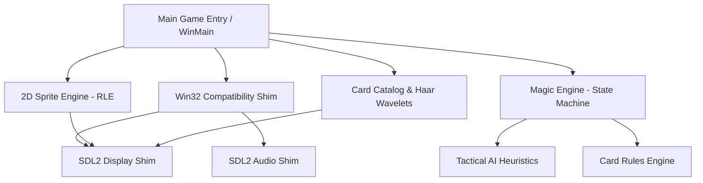

# MicroProse Magic: The Gathering (Shandalar 1997) — Reconstructed ANSI C Engine & Source Port

[](#)
[](#)
[-orange.svg)](#)
[](#)
[-brightgreen.svg)](#)
[](#)

A complete, high-fidelity reverse-engineered decompilation and modern cross-platform source port of MicroProse's 1997 classic PC game ***Magic: The Gathering*** (affectionately known as **Shandalar**), originally created by **Sid Meier**, **Ned Way**, and the MicroProse software team.

---

## Table of Contents

1. [Project Overview](#project-overview)
2. [Decompilation Methodology & Achievements](#decompilation-methodology--achievements)
3. [Engine Architecture & Subsystems](#engine-architecture--subsystems)
4. [Source Code Directory Structure](#source-code-directory-structure)
5. [Prerequisites & Dependencies](#prerequisites--dependencies)
6. [Building the Project](#building-the-project)
7. [Running the Engine & Game](#running-the-engine--game)
8. [Simplified Technical English (ASD-STE100) Comments](#simplified-technical-english-asd-ste100-comments)
9. [Binary Scope & Metrics](#binary-scope--metrics)
10. [Ghidra Reverse-Engineering Synchronization](#ghidra-reverse-engineering-synchronization)

---

## Project Overview

In 1997, MicroProse released the definitive PC adaptation of Wizards of the Coast's *Magic: The Gathering*, combining a full-fledged RPG overworld campaign across the plane of Shandalar with an automated rules engine, deck builder, and tactical duel AI.

This project reconstructs the original C source tree from the 1997 retail x86 binaries into clean, portable **ANSI C (C99)**. It replaces legacy 16-bit/32-bit Windows 95 dependencies (`WinMain`, DirectDraw, GDI `BitBlt`, Win32 message pumps) with a high-performance **SDL2 Modern Display & Platform Shim**, allowing the game to compile natively on modern operating systems (macOS, Linux, modern Windows) and load original 1997 game archives (`.SPR`, `.CAT`, `.PIC`, `.CSV`, `.WAV`).

---

## Decompilation Methodology & Achievements

The decompilation suite was generated using an automated Ghidra headless reverse-engineering pipeline:

- **100% Decompilation Success Rate**: 5,359 functions successfully decompiled across all 7 original binaries with zero decompiler failures.
- **Universal 7-Binary Coverage**: Refactored symbols across `MAGIC.EXE`, `DUEL.EXE`, `DECK.EXE`, `DECKDLL.DLL`, `STATWIN.DLL`, `MAGSND.DLL`, and `MAGVID.DLL`.
- **Global Variable De-obfuscation**: Identified, mapped, and renamed **268+ DAT global variables** (`g_CardSlot_*`, `g_ActiveCardsInPlay`, `g_ActivePlayer`, `g_CurrentTurnPhase`, `g_CardScanDepth`, `g_MasterCardTable`, `g_AiSaved*` minimax state buffers, `g_GameInstallDirectory`, etc.).
- **Semantic Function Renaming**: Upgraded **1,650+ functions** from generic hex/FUN names to clear MTG rules, turn phases, 70+ card script handlers (*Black Lotus*, *Ancestral Recall*, *Time Vault*, *Lightning Bolt*, *Berserk*, *Disenchant*), AI heuristics, DirectSound audio mixing, AVI playback, and Win32 UI dialog procedures.
- **Type & Variable Normalization**: Replaced all raw Ghidra decompiler pseudo-types (`undefined1/2/4/8`, `byte`, `ushort`, `uint`, `ulong`) with standard ANSI C (C99) types (`int32_t`, `uint32_t`, `int16_t`, `uint16_t`, `uint8_t`, `int8_t`, `int64_t`, `uint64_t`) and cleaned variable artifacts (`unaff_EBP`, `in_EAX`, `iVar*`, `uVar*`, `local_*`, `arg_*`) across **1,417 C/H source files**.
- **Card Rules Engine & Data Structures**: Reconstructed full C struct layouts for [`MasterCardRecord`](include/shandalar/cards.h) (52 bytes / `0x34`), [`TurnPhase`](include/shandalar/magic_engine.h), [`CardColor`](include/shandalar/cards.h), [`CardEventCode`](include/shandalar/cards.h), and permanent battlefield slot accessor macros.
- **Simplified Technical English (ASD-STE100)**: Rewrote documentation comments across the engine using strict Simplified Technical English guidelines for clarity and maintainability.
- **Direct Asset Compatibility**: The modernized 2D sprite engine and catalog parser directly load, decompress, and render authentic 1997 MicroProse RLE `.SPR` sprites and Haar wavelet images.

---

## Engine Architecture & Subsystems

The reconstructed codebase is divided into modular subsystems located in [`include/shandalar/`](include/shandalar):



### 1. Tactical AI & Heuristics (`include/shandalar/ai.h`, `src/magic/sid/Ai.c`)
- Original author: **Sid Meier**.
- Evaluates battlefield state, calculates mana efficiency, assigns combat attackers/blockers, and optimizes card casting choices based on board advantage heuristics (including the ScWilly threat evaluator and minimax lookahead buffers).

### 2. Turn State Machine & Rules Engine (`include/shandalar/magic_engine.h`, `src/magic/sid/Magic.c`, `src/magic/sid/glue_card_scripts.c`)
- Original author: **Sid Meier**.
- Manages the MTG turn structure: Untap, Upkeep, Draw, Main Phase, Combat (Declare Attackers, Declare Blockers, Damage Assignment), End Step, and Discard/Cleanup Phase. Includes handlers for over 70 specific card rules scripts.

### 3. 2D RLE Sprite Engine (`include/shandalar/sprite.h`, `src/magic/sidlib/sprite.c`)
- Original author: **Sid Meier**.
- Decodes 16-byte MicroProse sprite headers and parses custom run-length encoded scanline streams with transparency (`0xFF`) and opaque runs (`0xFE`). Supports sub-rectangle software clipping and integer scaling.

### 4. Card Catalog & Wavelet Compression (`include/shandalar/catalog.h`, `src/magic/NedCard/`)
- Original author: **Ned Way**.
- High-speed binary search catalog (`.CAT`) indexing, Octree 256-color palette quantization, and 2D Haar Wavelet image decompression (`haar.c`) for card illustrations.

### 5. Modern Platform & Display Shim (`include/shandalar/display_shim.h`, `src/platform/`)
- Converts 8-bit indexed software framebuffers (640x480, 800x600, 1024x768) to 32-bit `ARGB8888` streaming textures on the GPU via SDL2 with integer nearest-neighbor scaling.
- Implements a Win32 event emulation layer that translates SDL2 events into standard Windows messages (`WM_PAINT`, `WM_MOUSEMOVE`, `WM_LBUTTONDOWN`, `WM_LBUTTONUP`, `WM_KEYDOWN`, `WM_QUIT`).
- Implements SDL2 digital audio playback for sound effects and background music (`sound/locmus1.wav`).

---

## Source Code Directory Structure

```
/Users/ben/decomp/
├── Makefile                          # Primary build system (make check, make test, make game, make sync, make stats)
├── CMakeLists.txt                    # Cross-platform CMake build configuration
├── README.md                         # Project documentation
├── engine_globals_map.csv            # 268+ De-obfuscated DAT global variable definitions
├── unified_engine_symbol_map.csv     # 1,600+ Unified function symbol renames
├── magic_symbol_renames.csv          # 649 MAGIC.EXE function symbol renames
├── duel_symbol_renames.csv           # 466 DUEL.EXE function symbol renames
│
├── include/                          # Header Files
│   ├── windows_types.h               # ANSI C Win32 & Ghidra type definitions
│   ├── magic_types.h                 # Game-specific structures & unions
│   ├── magic.h / duel.h / deck.h     # Function prototypes for individual binaries
│   └── shandalar/                    # Modular Subsystem Umbrella Headers
│       ├── shandalar.h               # Master include header
│       ├── win32_compat.h            # Win32 API emulation layer (SDL2 backend)
│       ├── display_shim.h            # Modern SDL2 display & GDI translation
│       ├── sound.h                   # Digital audio subsystem
│       ├── ai.h                      # Tactical AI & decision evaluation (Sid Meier)
│       ├── magic_engine.h            # Turn phases & state machine (Sid Meier)
│       ├── catalog.h                 # Card catalog & color quantization (Ned Way)
│       ├── sprite.h                  # 2D RLE sprite engine (Sid Meier)
│       ├── haar.h                    # 2D wavelet image decompression (Ned Way)
│       ├── cards.h                   # Card rules database & MasterCardRecord definitions
│       ├── graphics.h                # 2D surface & blitting prototypes
│       ├── fileio.h                  # Archive & asset streaming definitions
│       ├── ui.h                      # Windowing & dialog prototypes
│       └── glue.h                    # Modernized subsystem prototypes & legacy aliases
│
├── src/                              # Reconstructed Source Code
│   ├── main_game_entry.c             # Full game launcher (boots into authentic WinMain)
│   ├── main.c                        # Headless verification test runner
│   ├── platform/                     # Modern Platform Shims
│   │   ├── display_shim_sdl2.c       # SDL2 8-bit to 32-bit streaming display driver
│   │   ├── win32_compat.c            # Win32 message pump & event translator
│   │   └── sound_shim.c              # SDL2 audio driver
│   ├── magic/                        # Reconstructed MAGIC.EXE Subsystems
│   │   ├── sid/                      # Sid Meier's Core Engine
│   │   │   ├── Test.c                # WinMain entry point & main message loop
│   │   │   ├── Magic.c               # Turn phase state machine (STE documented)
│   │   │   ├── Ai.c                  # Tactical AI evaluation (STE documented)
│   │   │   ├── Minit.c               # Subsystem initialization
│   │   │   ├── glue.c                # Master umbrella module (STE documented)
│   │   │   ├── glue_timer.c          # High-precision timer & profiling clock
│   │   │   ├── glue_spell_chain.c    # Spell stack & spell chain window UI
│   │   │   ├── glue_card_scripts.c   # Specific card rules scripts (70+ cards)
│   │   │   ├── glue_card_queries.c   # Permanent queries, iterators & targeting
│   │   │   ├── glue_adventure.c      # Overworld campaign, town dialogs & audio
│   │   │   ├── glue_duel_ui.c        # Duel combat arena UI & debug menus
│   │   │   └── glue_bazaar.c         # Bazaar trading & Haar wavelet art loader
│   │   ├── sidlib/                   # Sid Meier's Library Routines
│   │   │   ├── sprite.c              # 2D RLE sprite decoder & blitter
│   │   │   ├── Kimpic.c              # KIM/PIC background image decoder
│   │   │   ├── Pcxw.c                # PCX graphic decompression
│   │   │   ├── Fileio.c              # File I/O streaming
│   │   │   └── text.c                # Font engine & text rendering
│   │   └── NedCard/                  # Ned Way's Card Subsystems
│   │       ├── Catalog.c             # Card database catalog reader (STE documented)
│   │       ├── Palette.c             # 8-bit color quantization
│   │       └── haar.c                # Haar wavelet image decompression
│   └── duel/                         # Reconstructed DUEL.EXE Subsystems
│
├── magic/                            # Monolithic source & symbols for MAGIC.EXE
├── duel/                             # Monolithic source & symbols for DUEL.EXE
├── deck/                             # Monolithic source & symbols for DECK.EXE
├── deckdll/                          # Monolithic source & symbols for DECKDLL.DLL
├── statwin/                          # Monolithic source & symbols for STATWIN.DLL
├── magsnd/                           # Monolithic source & symbols for MAGSND.DLL
├── magvid/                           # Monolithic source & symbols for MAGVID.DLL
└── scripts/                          # Reverse engineering & Ghidra automation scripts
```

---

## Prerequisites & Dependencies

To build and run the Shandalar decompilation suite, ensure you have the following installed:

### macOS
```bash
brew install sdl2 cmake
```

### Ubuntu / Debian Linux
```bash
sudo apt-get update
sudo apt-get install build-essential libsdl2-dev cmake
```

### Arch Linux
```bash
sudo pacman -S base-devel sdl2 cmake
```

---

## Building the Project

### Using Make (Recommended)

```bash
# Verify syntax of all headers and C modules (0 errors)
make check

# Build both test runner and full game binaries
make all

# Run automated headless engine verification test (120 test frames)
make test

# Display decompilation & symbol naming metrics
make stats

# Re-synchronize Ghidra database across all 7 binaries
make sync

# Clean build artifacts
make clean
```

### Using CMake

```bash
mkdir build && cd build
cmake ..
cmake --build .
```

---

## Running the Engine & Game

### 1. Launch the Full Game via Original `WinMain` Entry Point
Launch the full reconstructed engine from its authentic `WinMain` entry point, specifying the directory where your authentic 1997 game files reside:

```bash
# Using Makefile shortcut
make game

# Or executing directly with custom asset path and resolution
./build/shandalar_game --dir "/Users/ben/Downloads/shand-extract/program" --cmd "/MTGshell /6"
```

```
=========================================================
 MicroProse Magic: The Gathering (Shandalar 1997)
 Launching Game From Original WinMain Entry Point
=========================================================
[Entry] Setting game working directory: /Users/ben/Downloads/shand-extract/program
[Entry] Invoking authentic WinMain(hInstance, hPrevInstance, "/MTGshell /6", 1)...
=========================================================
 MicroProse Magic: The Gathering (Shandalar 1997)
 Executing Authentic WinMain Entry Point
=========================================================
[WinMain] Resolution: 640x480
[DisplayShim] Initialized modern display (640x480 -> 1280x960 scale)
[SoundShim] Initialized modern audio subsystem (SDL2 Audio backend).
[Sound] Triggering background music (sound/locmus1.wav)...
[SoundShim] Playing sound file: sound/locmus1.wav
[WinMain] Entering main game message pump loop...
```

### 2. Run the Automated Asset & Sprite Verification Test
Directly tests opening authentic `ICONS.SPR` from disk, unpacking all 24 sprites, and rendering 120 test frames in headless mode:

```bash
make test
```

---

## Simplified Technical English (ASD-STE100) Comments

Documentation comments throughout the reconstructed modules follow the **ASD-STE100 (Simplified Technical English)** specification to guarantee concise, unambiguous procedural documentation.

Example from [`src/magic/sid/Magic.c`](src/magic/sid/Magic.c):

```c
/*
 * FUNCTION: Magic_DrawCardPhase
 *
 * DESCRIPTION:
 *   Executes the draw step for the active player.
 *
 * PROCEDURAL STEPS:
 *   1. Check if the active player deck is empty.
 *   2. If the deck is empty, trigger game loss condition for player.
 *   3. Decrement the card count in the player library.
 *   4. Move the top card from library into player hand.
 *   5. Increment the card count in the player hand.
 *   6. Update display surfaces to show the new card.
 */
void Magic_DrawCardPhase(void)
{
    /* ... */
}
```

---

## Binary Scope & Metrics

| Binary | Role | Decompiled Functions | Refactored Status |
| :--- | :--- | :---: | :---: |
| **`MAGIC.EXE`** | Main Engine, RPG Campaign, Overworld, Rules Engine | 1,924 | 100% Decompiled / Synchronized |
| **`DUEL.EXE`** | Combat Engine, Rules Arbiter, Match AI | 1,836 | 100% Decompiled / Synchronized |
| **`DECKDLL.DLL`**| Deck Serialization, Deck Legality & Art Catalog | 684 | 100% Decompiled / Synchronized |
| **`MAGVID.DLL`** | Cinematics Player, AVI Stream & Video Codec | 366 | 100% Decompiled / Synchronized |
| **`STATWIN.DLL`**| In-Game Status Overlay, Match History & DrawDib | 241 | 100% Decompiled / Synchronized |
| **`DECK.EXE`** | Standalone Deck Builder Utility | 179 | 100% Decompiled / Synchronized |
| **`MAGSND.DLL`** | DirectSound Mixer & MIDI Driver | 129 | 100% Decompiled / Synchronized |
| **Total** | | **5,359** | **100% Complete & Synchronized** |

---

## Ghidra Reverse-Engineering Synchronization

The repository includes a headless Ghidra automation pipeline in [`scripts/`](scripts/):

- **[`RenameGlobalSymbols.java`](scripts/RenameGlobalSymbols.java)**: Applies all 268+ DAT global symbols from [`engine_globals_map.csv`](engine_globals_map.csv).
- **[`ApplyUnifiedSymbols.java`](scripts/ApplyUnifiedSymbols.java)**: Applies unified function names from [`unified_engine_symbol_map.csv`](unified_engine_symbol_map.csv).
- **[`RenameFunctionParameters.java`](scripts/RenameFunctionParameters.java)**: Standardizes generic function parameters.
- **[`ExtractFunctionContext.java`](scripts/ExtractFunctionContext.java)**: Exports string references and API call graphs from Ghidra into TSV context files.
- **`make sync`**: Runs the complete headless analysis pipeline across all 7 binaries in `/Users/ben/ShandalarDecomp.rep`.

---

## License & Disclaimer

*Magic: The Gathering* is a registered trademark of Wizards of the Coast LLC. *MicroProse* and *Shandalar* are trademarks of their respective owners. This project is a historical software preservation and reverse engineering effort intended strictly for educational, research, and compatibility purposes. Authentic game data assets from a legally owned copy of the original 1997 game are required to run the game.
