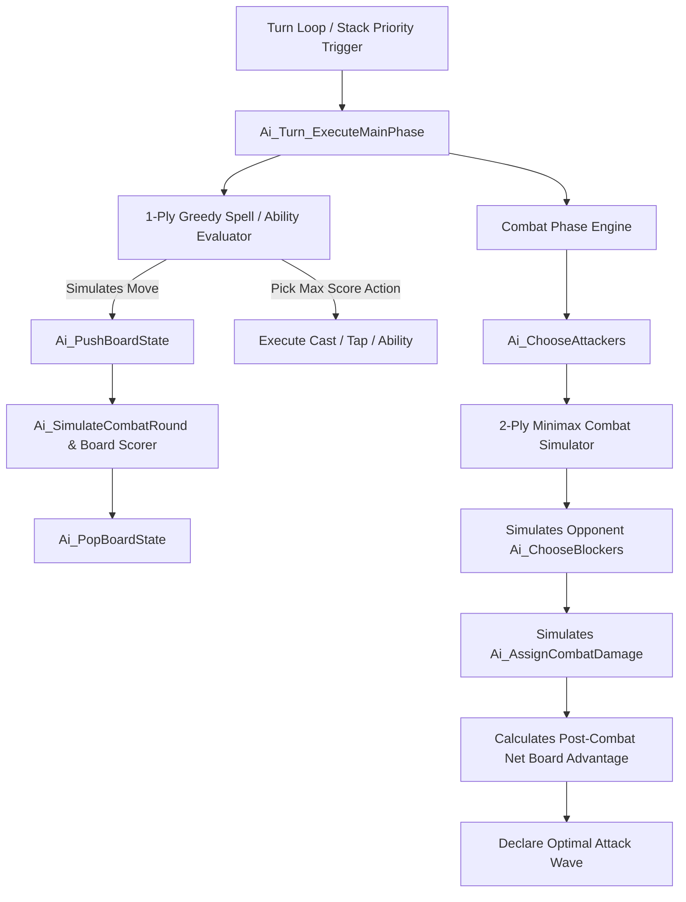

# MicroProse MTG (Shandalar) AI Engine - Technical FAQ & Guide

This document provides a comprehensive technical overview and FAQ detailing the inner workings of Sid Meier's tactical AI engine in *Magic: The Gathering* (MicroProse 1997 / Shandalar), as reconstructed in [`src/magic/sid/Ai.c`](../src/magic/sid/Ai.c) and [`include/shandalar/ai.h`](../include/shandalar/ai.h).

---

## 1. Overview of the Tactical AI Architecture

The tactical AI is responsible for evaluating battlefield positions, determining optimal spell and ability activations, managing mana curves, declaring attackers, assigning blockers, and reacting to spells on the stack.

---

## 2. Frequently Asked Questions (FAQ)

### Q1: Does the AI cheat by reading the cards in the player's hand?

> **No. The AI strictly respects the fog of war.** It does not inspect the card identities, types, or mana costs in the opponent's hand.

- **How it works in memory**: In the master state array, each player has 80 card slots (`g_CardSlot_CardId`). Each slot has state flags (`g_CardSlot_Flags`):
  - `0x01`: In Hand
  - `0x02`: In Play (Battlefield)
  - `0x04`: In Graveyard
  - `0x10`: Tapped
  - `0x20`: Summoning Sickness
- **Enforcement**: When evaluating threats, target candidates, or blocker trades, the AI's loops explicitly filter with `(flags & 0x02) != 0` (`Battlefield Only`).
- **What the AI knows about the hand**: Only the **card count** (`g_PlayerHandCardCount`), used purely to assess the opponent's card advantage.

---

### Q2: How does the AI calculate the battlefield score?

The core scoring engine is implemented in [`Ai_SimulateCombatRound`](../src/magic/sid/Ai.c) and [`Ai_ScoreBoardPosition`](../src/magic/sid/Ai.c). The composite score is the net differential between both players:

$$\text{NetScore} = \text{Score}(\text{AI}) - \text{Score}(\text{Opponent}) + \text{CombatAdvantage} + \text{LifeAdvantage} + \text{HandAdvantage}$$

#### 1. Creature Base Valuation Formula
For every active creature on the battlefield with effective Power ($P$) and Toughness ($T$):
$$\text{BaseValue} = \frac{(2P + 3) \times (T + 4)}{2}$$

#### 2. Keyword Ability Multipliers
The base creature value is multiplied by active combat attributes:
| Ability / Flag | Multiplier / Modification | Rationale |
| :--- | :---: | :--- |
| **Flying / Evasion** (`u_temp & 0x80`) | $\times 1.5$ ($3/2$) | Bypasses ground blockers |
| **First Strike** (`u_temp & 0x100`) | $\times 1.5$ ($3/2$) | Deals damage before receiving retaliation |
| **Protection from Color** (`u_temp & 0x200`) | $\times 1.5$ ($3/2$) | Complete immunity to matching color |
| **Regeneration / Subtype** (`subtype & 0x03`) | $\times 1.5$ ($3/2$) | High survival and persistence rate |
| **Trample** (`u_temp & 0x40`) | $\frac{(T + 1) \times \text{Value}}{2}$ | Excess damage penetrates to player |
| **Tapped while Defending** (`flags & 0x10`) | $-1$ point | Cannot block upcoming attack |

#### 3. Non-Creature Permanents
- **Basic Lands**: $+1$ to $+2$ points (untapped grants full tempo).
- **Artifacts / Enchantments**: $\text{CMC} \times 12$ points scaled by permanent synergy.

---

### Q3: How does the AI evaluate Life Totals and Card Advantage?

#### 1. Creature-Scaled Life Curve
Instead of treating life as a linear number, the AI weights life total against **battlefield creature presence**:
- **Creature Multiplier**:
  $$\text{Multiplier} = \sum_{k=1}^{N_{\text{creatures}}} \left(\left\lfloor \frac{24}{k} \right\rfloor + 12\right)$$
- **Life Score**:
  $$\text{LifeScore} = \frac{\text{LifeTotal} \times \text{Multiplier}}{8}$$
- **Vulnerability Penalty**:
  If a player controls 0 creatures, an emergency danger penalty of $(N_{\text{creatures}} - 2) \times (-256)$ is applied, forcing the AI to recognize that high life totals evaporate quickly against unblocked armies.

#### 2. Hand Card Advantage ([`Ai_CalcCardAdvantage`](../src/magic/sid/Ai.c))
Cards in hand provide diminishing returns calculated using a harmonic series:
$$\text{HandScore} = \sum_{k=1}^{N_{\text{hand}}} \left\lfloor \frac{48}{k} \right\rfloor$$
- Holding 1–4 cards provides massive utility bonuses.
- Holding $>7$ cards yields negligible bonus (since cards must be discarded).

---

### Q4: How does the AI search for moves (Search Depth & Lookahead)?

#### 1. Combat Lookahead (2-Ply Minimax)
When attacking:
1. **Candidate Generation**: The AI evaluates every subset of untapped creatures.
2. **Minimax Blocker Simulation**: For each candidate attack, the AI calls [`Ai_ChooseBlockers`](../src/magic/sid/Ai.c) to simulate the **optimal defensive response** the opponent would make.
3. **Damage Resolution**: Executes [`Ai_AssignCombatDamage`](../src/magic/sid/Ai.c) in memory and scores the resulting post-combat board.
4. **Decision**: The AI only attacks if the net board swing is positive.

#### 2. Main Phase Spells & Abilities (1-Ply In-Memory Simulation)
- For casting spells and activating artifacts/lands, the AI performs a 1-ply search across all legal actions.
- The simulation is executed by:
  1. [`Ai_PushBoardState`](../src/magic/sid/Ai.c): Clones the board, life totals, mana pools, and priorities onto an in-memory stack frame.
  2. Applying the candidate spell/ability.
  3. Evaluating the new board state score.
  4. [`Ai_PopBoardState`](../src/magic/sid/Ai.c): Restoring the authentic board state.

---

### Q5: How does the AI perform Threat Modeling and predict opponent actions?

Because the AI cannot see the opponent's hand cards, it predicts hidden threats using **public heuristic signals**:

1. **Open Mana Prediction**:
   - The AI monitors the opponent's untapped lands and mana pools (`g_PlayerManaPool`).
   - **Open Blue Mana**: Lowers confidence when casting expensive non-creature spells or big bombs to avoid walking into Counterspells.
   - **Open Red Mana**: Predicts direct damage (Lightning Bolt) and avoids attacking with valuable 1-to-3 toughness creatures.
   - **Open Green/White Mana during Combat**: Predicts combat tricks (Giant Growth, Healing Salve) and avoids marginal trades.
2. **Lethal Threat Scoring**:
   - If an attacking creature cannot be legally blocked by any enemy defender, it applies an immediate lethal threat bonus:
     $$\text{ThreatBonus} = \frac{\text{OpponentLife} \times 2P \times 24}{16} + 256$$

---

### Q6: How does the AI react to spells and instant-speed priority triggers?

When an opponent casts a spell or activates an ability, it enters the spell chain / stack (`g_SpellStackDepth`). Priority triggers pass to the AI, which invokes dedicated reactive heuristics:

- [`Ai_EvalAbility_Counterspell`](../src/magic/sid/Ai.c): Analyzes the incoming spell. Counters board wipes (Wrath of God), lethal burn, or high-cost bombs while ignoring low-impact spells.
- [`Ai_EvalAbility_PumpSpell`](../src/magic/sid/Ai.c): Holds Giant Growth / Blood Lust until the combat damage step, casting only if it saves a friendly creature from lethal damage or pushes lethal damage to the opponent.
- [`Ai_EvalAbility_DamagePrevention`](../src/magic/sid/Ai.c): Triggers Samite Healer / Healing Salve in response to targeted burn or fatal combat damage to preserve high-value creatures.

---

## 3. Reconstructed Codebase Reference Map

| Component / Subsystem | Primary Source File | Primary Header | Key Functions |
| :--- | :--- | :--- | :--- |
| **Tactical Board Evaluation** | [`src/magic/sid/Ai.c`](../src/magic/sid/Ai.c) | [`include/shandalar/ai.h`](../include/shandalar/ai.h) | `Ai_SimulateCombatRound`, `Ai_ScoreBoardPosition`, `Ai_EvaluateCreaturePower` |
| **State Push/Pop Lookahead** | [`src/magic/sid/Ai.c`](../src/magic/sid/Ai.c) | [`include/shandalar/ai.h`](../include/shandalar/ai.h) | `Ai_PushBoardState`, `Ai_PopBoardState`, `Ai_SaveGameState`, `Ai_RestoreGameState` |
| **Combat Minimax Decisions** | [`src/magic/sid/Ai.c`](../src/magic/sid/Ai.c) | [`include/shandalar/ai.h`](../include/shandalar/ai.h) | `Ai_ChooseAttackers`, `Ai_ChooseBlockers`, `Ai_FilterValidBlockers`, `Ai_AssignCombatDamage` |
| **Spell Scoring & Mana Calculation** | [`src/magic/sid/Ai.c`](../src/magic/sid/Ai.c) | [`include/shandalar/ai.h`](../include/shandalar/ai.h) | `Ai_ScoreCardPlay_Creature`, `Ai_ScoreCardPlay_Spell`, `Ai_CalcManaRequirement_*` |
| **Turn Phase Orchestration** | [`src/magic/sid/Magic.c`](../src/magic/sid/Magic.c) | [`include/shandalar/magic_engine.h`](../include/shandalar/magic_engine.h) | `Magic_MainTurnPhase`, `Magic_CombatPhase`, `Magic_CheckTurnTriggers` |
| **Spell Chain Stack UI** | [`src/magic/sid/glue_spell_chain.c`](../src/magic/sid/glue_spell_chain.c) | [`include/shandalar/glue.h`](../include/shandalar/glue.h) | `SpellChain_WndProc`, `SpellChain_ProcessTriggerEvent` |
