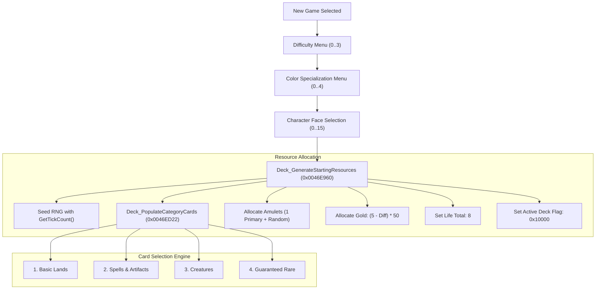
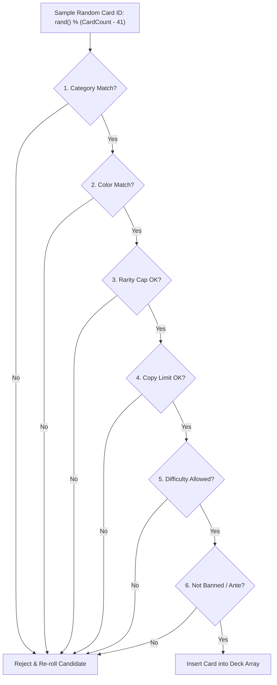

# MicroProse MTG (Shandalar) - Starting Resources Specification

This document provides a technical specification for the allocation of starting resources in *Magic: The Gathering* (MicroProse 1997 / Shandalar). 

All text in this document follows **Simplified Technical English (ASD-STE100)** rules.

---

## 1. Scope

This specification describes how the game engine allocates initial resources to the player when a new campaign begins.

Starting resources include:
- **Card Deck**: 36 to 45 cards based on chosen difficulty and color.
- **Amulets**: 1 to 4 magic amulets based on difficulty.
- **Gold**: 100 to 250 starting gold coins based on difficulty.
- **Life Points**: 8 initial life points.

---

## 2. Technical Architecture

The starting resource allocation occurs during character creation in [`Adventure_EnterTownLocation`](../magic/functions/Adventure_EnterTownLocation_004e73a0.c).

---

## 3. Player Configuration Inputs

Before the engine generates resources, the player selects three parameters:

1. **Difficulty Level** (`g_CampaignDifficultyLevel`):
   - `0`: Apprentice (Easy)
   - `1`: Mage (Medium)
   - `2`: Archmage (Hard)
   - `3`: Wizard (Expert)

2. **Starting Color** (`g_SelectedStartingColor`):
   - `0`: White
   - `1`: Blue
   - `2`: Black
   - `3`: Red
   - `4`: Green

3. **Character Portrait Index**: 0 to 15.

---

## 4. Starting Deck Specification

The system builds the player starting deck procedurally using **rejection sampling**. The system does not use static deck lists.

### 4.1 Card Quotas by Difficulty

| Difficulty Level | Color Configuration | Basic Lands | Spells & Artifacts | Creatures | Guaranteed Rares | Total Deck Size |
| :--- | :--- | :--- | :--- | :--- | :--- | :--- |
| **0 (Apprentice)** | 1 (Primary Color) | 13 | 12 | 10 | 1 | **36 Cards** |
| **1 (Mage)** | 2 (Primary + 1 Secondary) | 15 (11 + 4) | 7 (4 + 3) | 16 (12 + 4) | 1 | **39 Cards** |
| **2 (Archmage)** | 3 (Primary + 2 Secondary) | 18 (9 + 5 + 4) | 9 (3 + 3 + 3) | 16 (9 + 4 + 3) | 1 | **44 Cards** |
| **3 (Wizard)** | 5 (All Colors) | 17 (6 + 11 random) | 8 (3 + 5 random) | 19 (5 + 14 random) | 1 | **45 Cards** |

### 4.2 Multi-Color Distribution Breakdown

#### Level 1: Mage (Two-Color Deck)
- **Primary Color**: 11 Basic Lands, 4 Spells/Artifacts, 12 Creatures, 1 Guaranteed Rare (28 cards).
- **Secondary Color**: 4 Basic Lands, 3 Spells/Artifacts, 4 Creatures, 0 Rares (11 cards).

#### Level 2: Archmage (Three-Color Deck)
- **Primary Color**: 9 Basic Lands, 3 Spells/Artifacts, 9 Creatures, 1 Guaranteed Rare (22 cards).
- **Secondary Color**: 5 Basic Lands, 3 Spells/Artifacts, 4 Creatures, 0 Rares (12 cards).
- **Tertiary Color**: 4 Basic Lands, 3 Spells/Artifacts, 3 Creatures, 0 Rares (10 cards).

#### Level 3: Wizard (Five-Color Deck)
- **Primary Color**: 6 Basic Lands, 3 Spells/Artifacts, 5 Creatures, 1 Guaranteed Rare (15 cards).
- **Random Colors**: 11 Basic Lands, 5 Spells/Artifacts, 14 Creatures, 0 Rares (30 cards).

---

## 5. Candidate Validation Filters

When the generator rolls a candidate card, the card must pass **6 validation rules**:

### 1. Card Category Quota
- **Basic Land Slots**: Accepts only card IDs 0 through 4 (Plains, Island, Swamp, Mountain, Forest).
- **Spell Slots**: Rolls a 50% chance for a colored spell (Instant, Sorcery, Enchantment) or a colorless Artifact.
- **Creature Slots**: Accepts only cards with creature type attributes.
- **Guaranteed Rare Slot**: Accepts non-land cards with Rarity $\ge 3$.

### 2. Color Compatibility ([`Catalog_MatchCardColor`](../magic/functions/Pic_Subsystem_004521a6_004521a6.c))
- The candidate card must match the active target color bitmask.

### 3. Rarity Tiering ([`Catalog_GetCardRarity`](../magic/functions/Pic_Subsystem_00452551_00452551.c))
- **Odd Card Slots**: Capped at **Common** (Rarity 1).
- **Even Card Slots**: Capped at **Uncommon** (Rarity 2).
- **Standard Slots**: Reject Rare cards (Rarity 3).
- **Guaranteed Rare Slot**: Rejects cards with Rarity $< 3$.

### 4. Duplicate Copy Limit ([`Deck_GetRemainingAllowedCopies`](../magic/functions/Duel_UpdateCardMotionStep_004f0b50.c))
- Basic lands have no copy limits.
- Non-land cards cannot exceed **1 copy** in the starting deck.

### 5. Complexity & Difficulty Restrictions
- On Apprentice difficulty, the engine filters out complex card mechanics (`DAT_0051aecc & 3`).

### 6. Banned and Ante Filter
- The engine rejects cards flagged as Ante or invalid (`DAT_0051aed1 & 9`).

---

## 6. Amulet Allocation Specification

The engine allocates magic amulets to the player inventory with this formula:

$$\text{Total Amulets} = 1 + (3 - \text{Difficulty Level})$$

| Difficulty Level | Primary Color Amulets | Random Bonus Amulets | Total Amulets |
| :--- | :--- | :--- | :--- |
| **0 (Apprentice)** | 1 | 3 | **4 Amulets** |
| **1 (Mage)** | 1 | 2 | **3 Amulets** |
| **2 (Archmage)** | 1 | 1 | **2 Amulets** |
| **3 (Wizard)** | 1 | 0 | **1 Amulet** |

---

## 7. Gold Allocation Specification

The engine calculates starting gold coins with this linear formula:

$$\text{Starting Gold} = (5 - \text{Difficulty Level}) \times 50$$

| Difficulty Level | Calculation | Starting Gold |
| :--- | :--- | :--- |
| **0 (Apprentice)** | $(5 - 0) \times 50$ | **250 Gold** |
| **1 (Mage)** | $(5 - 1) \times 50$ | **200 Gold** |
| **2 (Archmage)** | $(5 - 2) \times 50$ | **150 Gold** |
| **3 (Wizard)** | $(5 - 3) \times 50$ | **100 Gold** |

---

## 8. Life Points & Memory State Flags

- **Starting Life**: Set to **8 Life Points** (`g_PlayerLifeTotals = 8`).
- **Inventory Flag**: The system sets bit `0x10000` on each assigned card in the 500-slot card array (`deck[]`). This marks the card as active in the player main deck.
- **Color Territory**: The system stores the player home territory flag in `g_OverworldMovementFlags`.

---

## 9. Core Function Reference

| Function Symbol | Virtual Address | Source File | Description |
| :--- | :--- | :--- | :--- |
| [`Deck_GenerateStartingResources`](../src/magic/world/engine_core.c#L10403-L10499) | `0x0046E960` | `src/magic/world/engine_core.c` | Top-level starting resource generator. |
| [`Deck_PopulateCategoryCards`](../src/magic/world/engine_core.c#L10500-L10612) | `0x0046ED22` | `src/magic/world/engine_core.c` | Category-based card sampler and validator. |
| [`Deck_PickRandomSecondaryColor`](../src/magic/world/engine_core.c#L10388-L10402) | `0x0046E922` | `src/magic/world/engine_core.c` | Random non-duplicate color selector. |
| `Catalog_SampleRandomCardByTypeAndColor` | `0x00451D90` | `magic/functions/Pic_Subsystem_00451d90_00451d90.c` | Samples random card from master catalog. |
| `Deck_InsertCardSorted` | `0x00451E40` | `magic/functions/Pic_Subsystem_00451e40_00451e40.c` | Inserts card into player inventory array. |
| `Catalog_MatchCardColor` | `0x004521A6` | `magic/functions/Pic_Subsystem_004521a6_004521a6.c` | Color matching and allied color check. |
| `Catalog_GetCardRarity` | `0x00452551` | `magic/functions/Pic_Subsystem_00452551_00452551.c` | Evaluates card rarity (Common, Uncommon, Rare). |
| `Deck_GetRemainingAllowedCopies` | `0x004F0B50` | `magic/functions/Duel_UpdateCardMotionStep_004f0b50.c` | Enforces card duplicate copy limits. |
